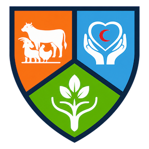
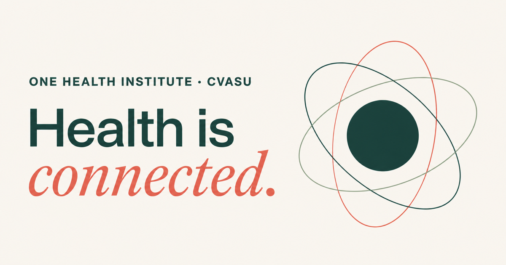
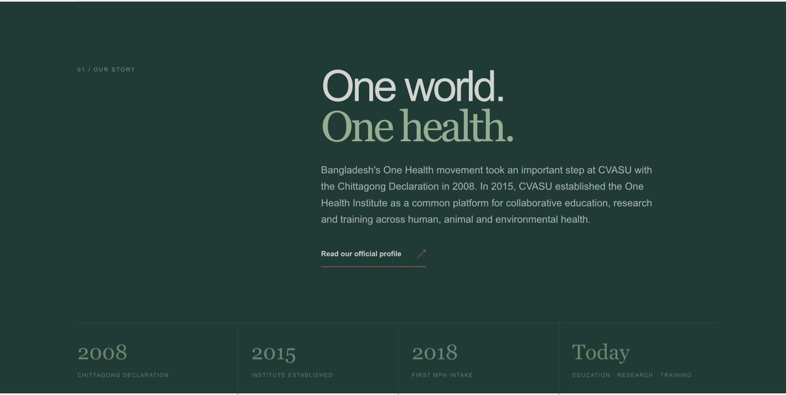
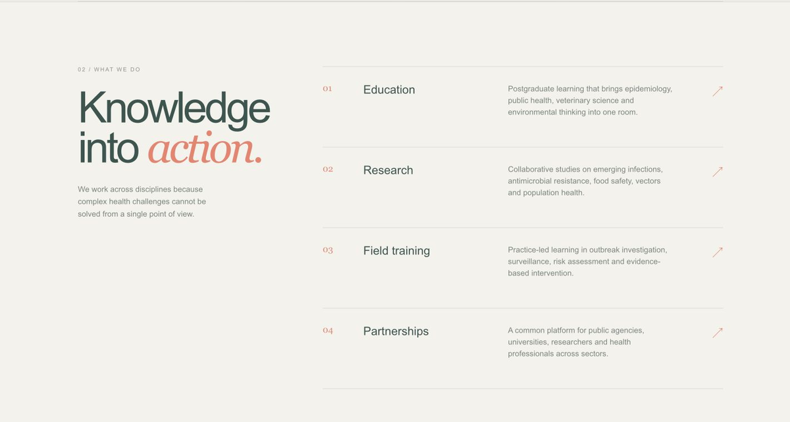
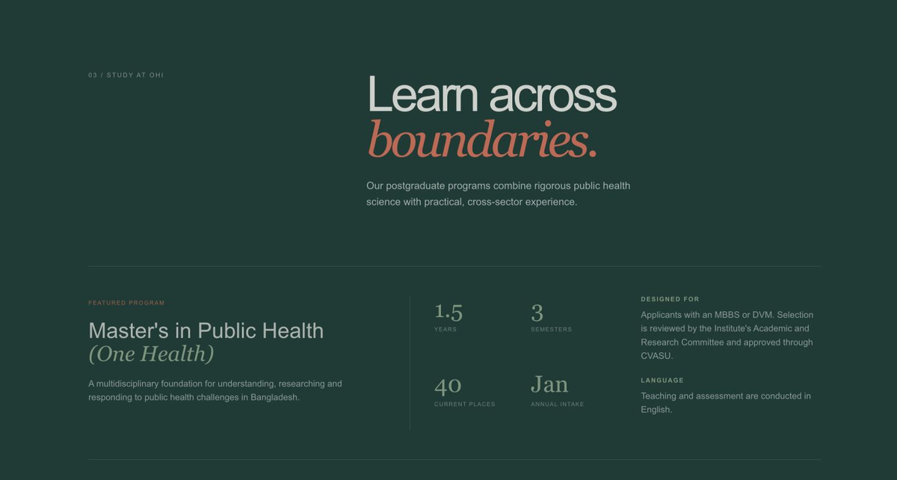
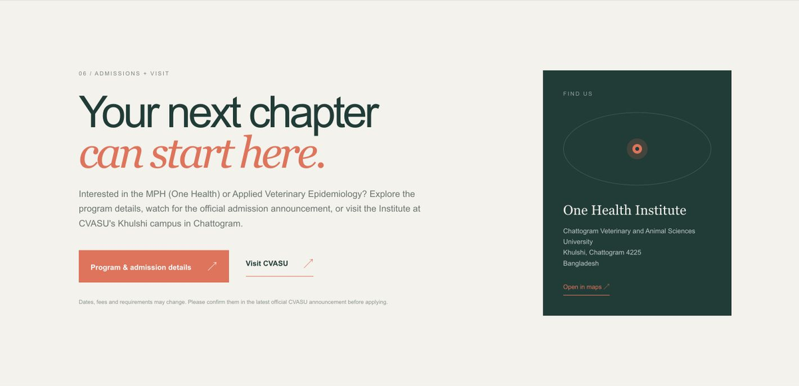
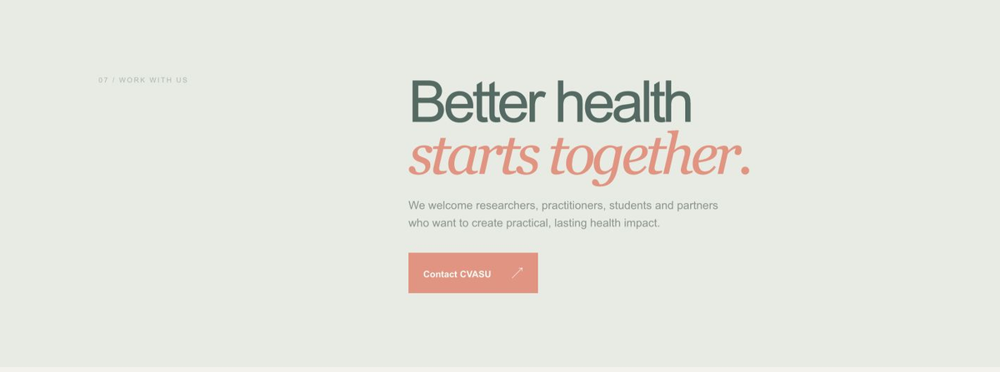
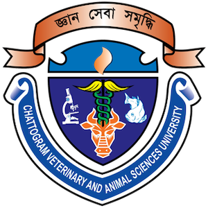

  

  <h1>One Health Institute</h1>
  
<strong>Chattogram Veterinary and Animal Sciences University</strong>

  
<em>Connecting human, animal and environmental health.</em>

  

    <a href="https://ohi.ac.bd"><strong>Explore the Institute&nbsp; ↗</strong></a>
    &nbsp;&nbsp;·&nbsp;&nbsp;
    <a href="https://cvasu.ac.bd/office/one-health-institute"><strong>Official CVASU profile</strong></a>
  

 

 

  <h2>Health is connected.</h2>
  

    The One Health Institute at CVASU connects people, disciplines and ideas 
    to strengthen public health in Bangladesh and beyond.
  

 

## 01 / Our story

### One world. One health.

Bangladesh's One Health movement took an important step at CVASU with the Chittagong Declaration in 2008. In 2015, CVASU established the One Health Institute as a common platform for collaborative education, research and training across human, animal and environmental health.

| 2008 | 2015 | 2018 | Today |
|:---:|:---:|:---:|:---:|
| Chittagong Declaration | Institute established | First MPH intake | Education · research · training |

 

## 02 / What we do

### Knowledge into action.

We work across disciplines because complex health challenges cannot be solved from a single point of view.

<table>
  <tr>
    <td width="50%" valign="top">
      <h3>Education</h3>
      
Postgraduate learning that brings epidemiology, public health, veterinary science and environmental thinking into one room.

    </td>
    <td width="50%" valign="top">
      <h3>Research</h3>
      
Collaborative studies on emerging infections, antimicrobial resistance, food safety, vectors and population health.

    </td>
  </tr>
  <tr>
    <td width="50%" valign="top">
      <h3>Field training</h3>
      
Practice-led learning in outbreak investigation, surveillance, risk assessment and evidence-based intervention.

    </td>
    <td width="50%" valign="top">
      <h3>Partnerships</h3>
      
A common platform for public agencies, universities, researchers and health professionals across sectors.

    </td>
  </tr>
</table>

 

## 03 / Study at OHI

### Learn across boundaries.

Our postgraduate programs combine rigorous public health science with practical, cross-sector experience.

### Master's in Public Health *(One Health)*

A multidisciplinary foundation for understanding, researching and responding to public health challenges in Bangladesh. The program is designed for applicants with an MBBS or DVM, and teaching and assessment are conducted in English.

| Duration | Structure | Current places | Annual intake |
|:---:|:---:|:---:|:---:|
| **1.5 years** | **3 semesters** | **40** | **January** |

**Selected curriculum:** Epidemiology and research methods · Biostatistics · Zoonoses and emerging diseases · Food safety and risk assessment · Antimicrobial resistance · Climate and vector-borne disease · Health economics and policy · GIS for public health · Research project and thesis

### MS in Applied Veterinary Epidemiology

A two-year program for registered veterinarians, aligned with the Field Epidemiology Training Program for Veterinarians—combining **30% classroom learning** with **70% fieldwork**.

 

## 04 / Research

### Questions that cross borders.

Our research responds to health priorities where people, animals, food systems and environments meet.

- **Emerging infections** — Strengthening surveillance, preparedness and the people and systems needed to respond before an outbreak.
- **AMR and food systems** — Investigating antimicrobial resistance, residues and risks across animal-origin food and the wider food system.
- **Climate and vectors** — Building knowledge on vector-borne disease, climate-linked health threats and ecological drivers in Bangladesh.

 

## 05 / Our network

### Collaboration is the method.

CVASU's One Health Institute works with government services, public health institutions, universities and global health partners.

Collaborations cited by the Institute include **DLS**, the **Forest Department**, **BITID**, **IEDCR**, **icddr,b**, the **University of California**, and **Global Health Development / EMPHNET**.

 

## 06 / Admissions + visit

### Your next chapter can start here.

Interested in the MPH (One Health) or Applied Veterinary Epidemiology? Explore the program details, watch for the official admission announcement, or visit the Institute at CVASU's Khulshi campus in Chattogram.

**One Health Institute**  
Chattogram Veterinary and Animal Sciences University  
Khulshi, Chattogram 4225, Bangladesh

[Program and admission details ↗](https://cvasu.ac.bd/office/one-health-institute) &nbsp;·&nbsp; [Open CVASU ↗](https://cvasu.ac.bd/) &nbsp;·&nbsp; [Find the campus ↗](https://maps.google.com/?q=Chattogram+Veterinary+and+Animal+Sciences+University)

> Admission dates, fees and requirements may change. Please confirm them in the latest official CVASU announcement before applying.

 

## 07 / Work with us

### Better health starts together.

We welcome researchers, practitioners, students and partners who want to create practical, lasting health impact.

  
<strong>Ready to connect?</strong>

  

    <a href="mailto:registrar@cvasu.ac.bd"><strong>Contact CVASU&nbsp; ↗</strong></a>
  

 

---

  
  &nbsp;&nbsp;&nbsp;&nbsp;
  

  
<strong>One Health Institute · CVASU</strong>

  
Khulshi, Chattogram 4225 · Bangladesh

  

    <a href="https://ohi.ac.bd"><strong>ohi.ac.bd</strong></a>
    &nbsp;&nbsp;·&nbsp;&nbsp;
    <a href="https://cvasu.ac.bd/office/one-health-institute">Official CVASU profile</a>
  

